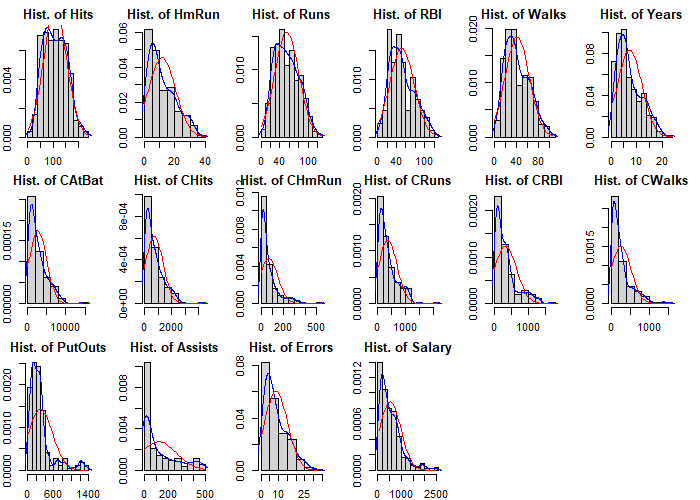
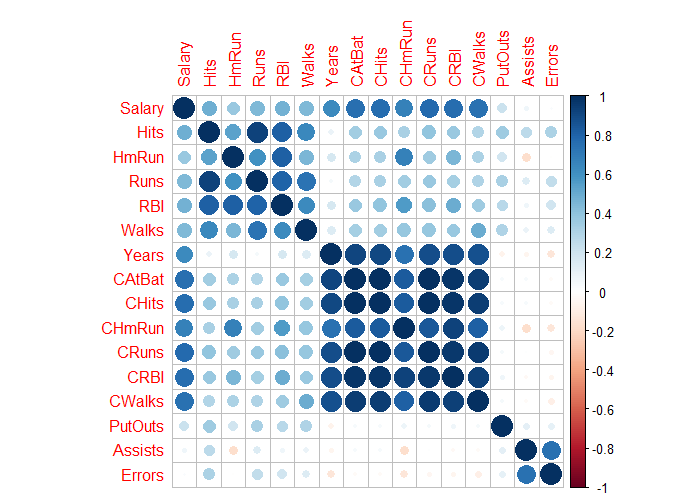
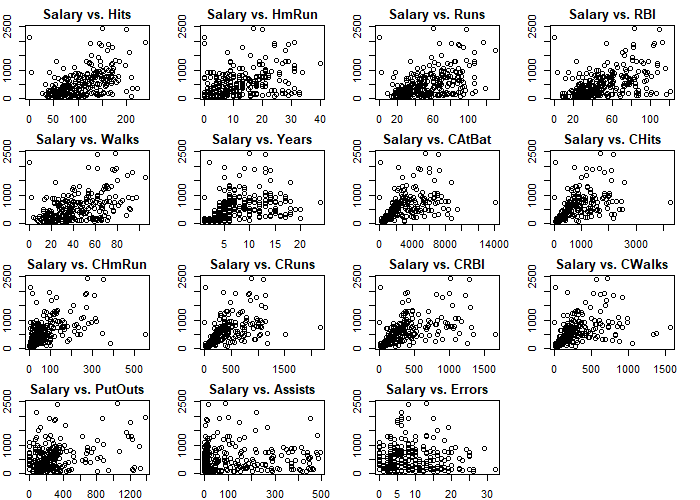
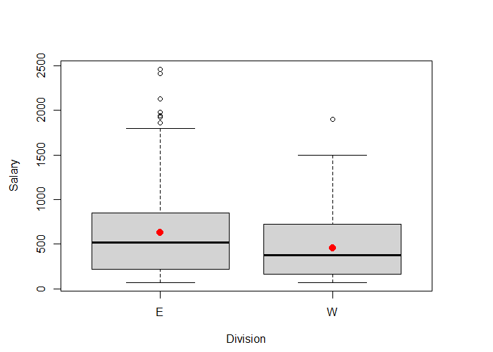

# R_CS_04
Sports Analytics in R

### Case-Study Title: Sports Analytics via Step-wise Regression (Subset Selection Regression)
### Data Analysis methodology: CRISP-DM
### Dataset: Hitters dataset (Major League Baseball Data from the 1986 and 1987 seasons in US)
### Case Goal: Annual Salary prediction of each Player in 1987 base on his performance in 1986

Distribution of all continuous predictor variables

Correlation plot between Salary and other continuous predictor variables

Scatter plot between Salary and other continuous predictor variables

Salary Distribution in Division variable categories

Actuals versus Predictions plot (final model performance evaulation in Test dataset)

